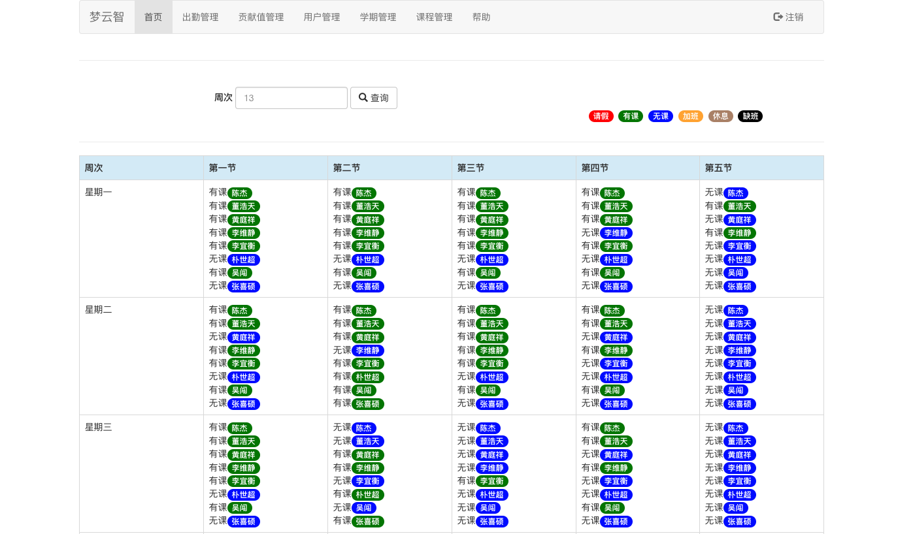

张喜硕

河北工业大学 软件工程专业 2016级本科生

梦云智软件开发团队成员

2017年5月21日初入团队，目前在团队从事`web`全栈开发工作。

**加入团队之前**

在学校的课程安排下学习了`C`与`C++`语言，`96`分，成绩很好，但是却不明白面向对象。

喜欢捯饬各种新技术，对技术充满热爱，学习过`HTML`、微信小程序、`Android`、`QT`等技术，学习热情很高，但水平不够，未取得什么太大的进展。

**2017年5月 - 2017年6月**

在甜姐的管理下，学习[Bootstrap](https://v3.bootcss.com)。

并与朱晨澍、朴世超、周杰三人一同使用`Bootstrap`编写仿大众点评首页的静态页面。

**2017年6月 - 2017年7月**

学习团队教程[ThinkPHP5.0入门实例教程](https://www.kancloud.cn/yunzhiclub/thinkphp5guide)。

学习的第一款框架，当写出一个教务管理系统时，成就满满。

**2017年7月 - 2017年8月**

使用`ThinkPHP`开发云智课程管理系统。

团队内部使用。第一个用来练手的项目，代码写的不规范，但是最后功能还算齐全。

用于维护团队人员的基本信息、学期信息、课程信息、出勤信息、团队贡献值信息等。本系统旨在能随时查看团队人员的课程信息，方便了任务分配。

**2017年8月 - 2017年9月**
